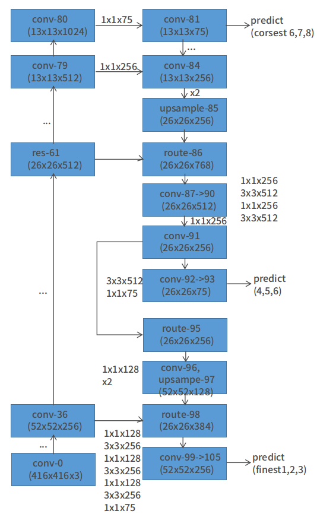
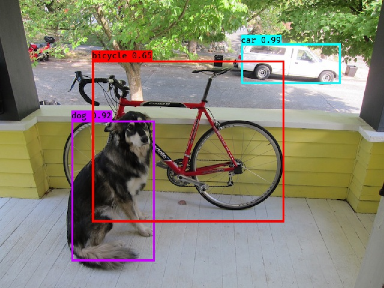

# YOLOv3_tf
Try to implement YOLOv3 with TensorFlow
1. transform darknet weight into npz: **save_npz.py**
2. darknet 52 conv layer: **darknet53_trainable.py**
3. yolo layer(loss & predict): **yolo_layer.py**

 

 

#### train (train_net.py)
    1. for now, only train detector layer(50 epoch, batch size: 8)
    2. froze feature extractor('darknet53.conv.74')
    3. TODO: finetune end2end
_traindata: VOC2007 trainval & VOC2012 trainval_
#### sample prediction (predict_net.py)
 

 
 

#### trained weights
- [pan.baidu](https://pan.baidu.com/s/1fQ73S3HVoMeY8Tz5um12Mw)  key: lbd4
- [Dropbox](https://www.dropbox.com/sh/by0ma8p4n3godgb/AAAGhp4w-_F6aPL_EJ8ShSGba?dl=0)
#### Acknowledgements & Reference
- :fire: [Darknet](https://github.com/pjreddie/darknet) :fire:
- :fire: [YAD2K](https://github.com/allanzelener/YAD2K) :fire:

##### Requirement
    1. TensorFlow 1.*
    2. easydict
    3. PIL
    4. numpy
    5. matplotlib
